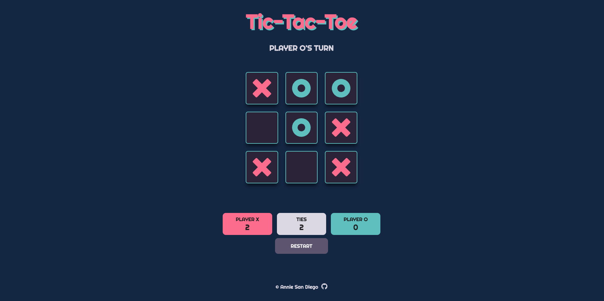
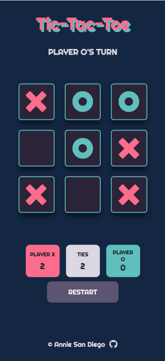

# The Odin Project - Tic Tac Toe

Tic-Tac-Toe game playable in the browser. This was built with HTML5, CSS3, and Vanilla JavaScript. It is also a practice on the use of 2 common design patterns: the module pattern and factory pattern.

Live Site URL here: [https://amsandiego.github.io/tic-tac-toe](https://amsandiego.github.io/tic-tac-toe)

### Features

Desktop View

Mobile View

- A two-player tic-tac-toe game playable in desktop and mobile.
- Players can play multiple rounds and track number of wins per player and ties.
- Beautiful CSS effects for button presses, hover, and winning combination to improve game experience.
